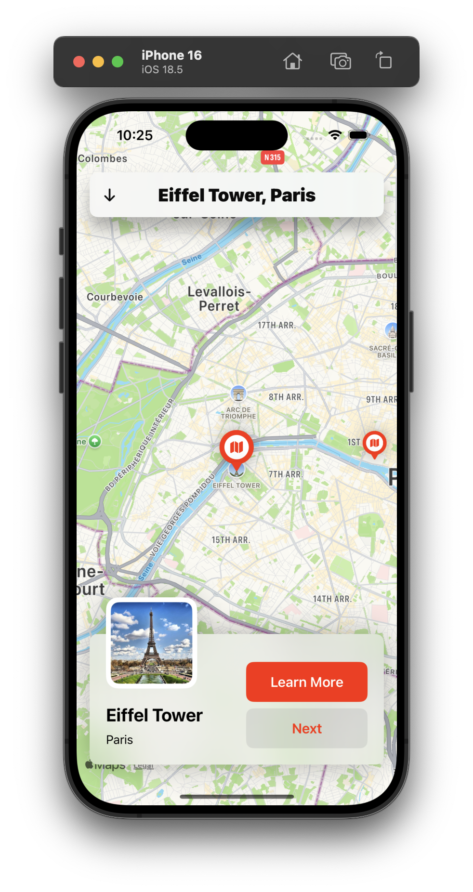
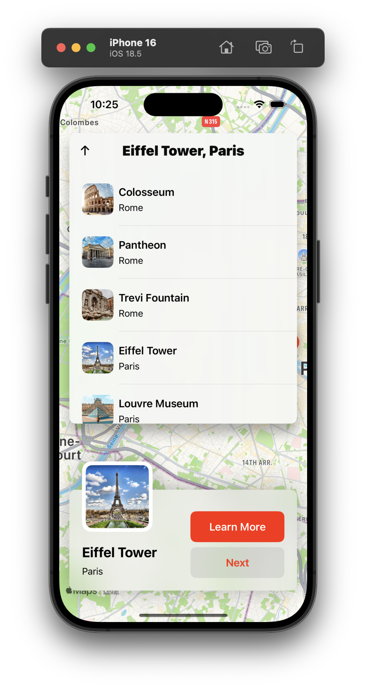
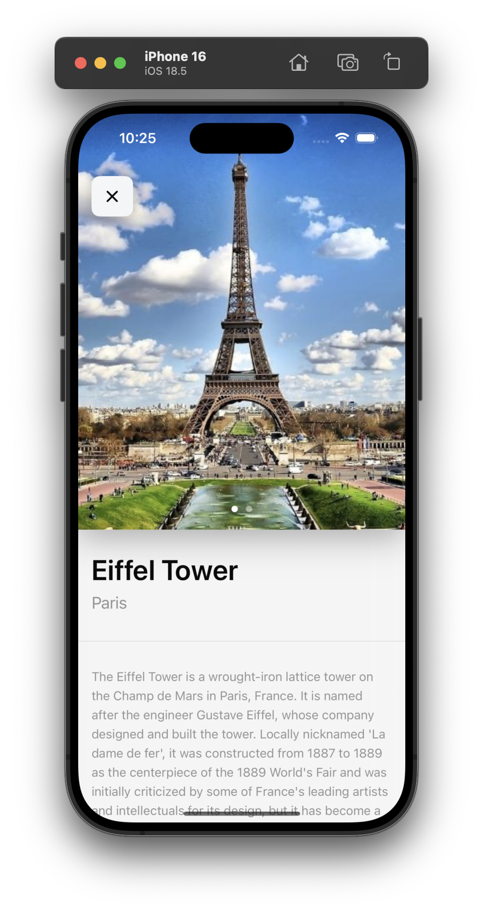
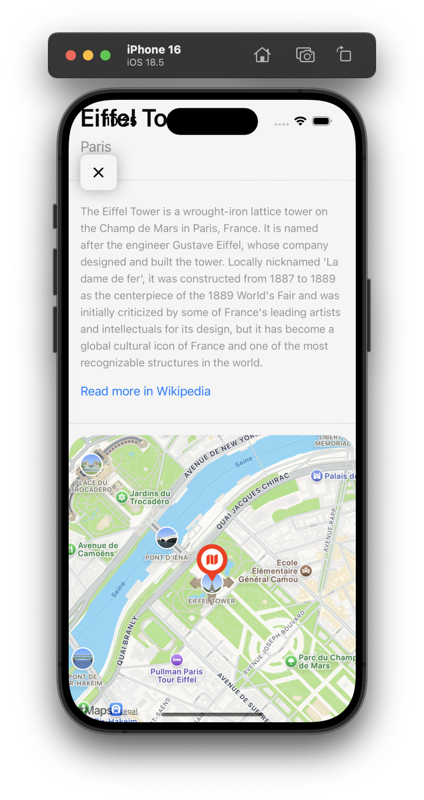

# MapApplication 🗺️  
A beginner-friendly SwiftUI-based iOS app that displays predefined location data on a map. The app is built to explore and understand how to integrate MapKit with SwiftUI, use annotations, and navigate between different points of interest.

---

## 🚀 Features  
📍 Display Predefined Locations on Map  
📌 Add Annotation for Each Location  
🔄 Switch Between Available Locations  
➡️ "Next" Button to Cycle Through Locations  
ℹ️ Learn More with Details and Images  
🔗 Link to Wikipedia for Each Location  
🎨 Simple SwiftUI Interface for Learning  
📱 Responsive Layout for iPhone & iPad  
🧭 MVVM Architecture for Clean Code  
🧩 Reusable Views and Components  
🌙 Dark Mode Support  

---

## 🧰 Tech Stack  
🧑‍💻 Language: Swift  
🖼️ UI Framework: SwiftUI  
🗺️ Maps: Apple MapKit  
📦 Architecture: MVVM  
🛠️ State Management: Combine  
💻 IDE: Xcode  
🚀 Deployment Target: iOS 15+  

---

## 📸 Screenshots  

### Map View 


### Available Locations  


### Learn More Page  



---

## 📁 Project Structure  
```

├── MapApplication.xcodeproj
|   ├── project.pbxproj
|   ├── project.xcworkspace
|   │   └── contents.xcworkspacedata
|   └── xcuserdata
├── MapApplication
|   ├── Assets.xcassets
|   │   ├── AccentColor.colorset
|   │   │   └── Contents.json
|   │   ├── AppIcon.appiconset
|   │   ├── Contents.json
|   │   ├── Locations
|   │   │   ├── Contents.json
|   │   │   ├── Paris
|   │   │   └── Rome
|   │   └── Logos
|   ├── ContentView.swift
|   ├── DataServieces
|   │   └── LocationsDataService.swift
|   ├── Info.plist
|   ├── Models
|   │   └── Location.swift
|   ├── ViewModels
|   │   └── LocationsViewModel.swift
|   └── Views
|   │   ├── LocationDetailView.swift
|   │   ├── LocationListView.swift
|   │   ├── LocationMapAnnotationView.swift
|   │   ├── LocationPreviewView.swift
|   │   └── LocationsView.swift
└── MapApplicationApp.swift

````

---

## 🛠️ Getting Started  

### Prerequisites  
- Xcode (latest stable version)  
- iOS SDK (latest)  
- Basic understanding of SwiftUI  

### Installation  
```bash
git clone https://github.com/SameerNadaf/MapApplication.git  
cd MapApplication  
open MapApplication.xcodeproj  
````

### Run the App

1. Choose your simulator or physical iOS device
2. Press **Cmd + R** to build & run

---

## 📱 Usage

* Launch the app to see a predefined location on the map
* Tap **Next** to view another location
* Click **Learn More** to see details, images, and a Wikipedia link

---

## 🎓 Learning Purpose

This app was created as a hands-on learning project to explore:

* SwiftUI integration with MapKit
* MVVM architecture in iOS apps
* Managing multiple views and data
* Basic user interaction with maps

---

## 🤝 Contributing

This is a learning-focused project, but feel free to fork and play with it!
Suggestions and pull requests are welcome.

---

## 🪪 License

MIT License

---

## 📬 Contact & Attribution

Developed by **Sameer Nadaf**
GitHub: [SameerNadaf](https://github.com/SameerNadaf/MapApplication)
⭐️ Drop a star if you found this helpful for your learning!

---

## 🙌 Acknowledgments

* Apple MapKit for map integration
* SwiftUI & Combine frameworks
* Open-source SwiftUI learning resources
